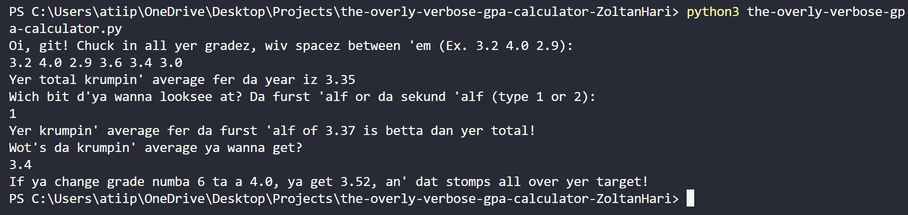

[](https://classroom.github.com/a/38izMa6v)
[](https://classroom.github.com/open-in-codespaces?assignment_repo_id=21070649)

# The Overly Verbose GPA Calculator

The Overly Verbose GPA Calculator is a fun way to see what your GPA is for all of your classes with the twist being that it can only speak in a British-Cockney accent inspired by the Ork Language from the Warhammer universe. The GPA calculator will use the grades from all of your classes throughout the year to give you your total GPA, GPA for each semester, and tell you if you can reach your target GPA

## Requirements
- Python 3.8 or higher
- Git Installed


## Installation
```bash
git clone https://github.com/WTCSC/the-overly-verbose-gpa-calculator-ZoltanHari.git

cd the-overly-verbose-gpa-calculator-ZoltanHari
```

## How to Use

1. Run the Calculator with the command **`python3 the-overly-verbose-gpa-calculator.py`** in the terminal
 
2. Follow the Instructions Provided

### Example Equations



## Decision Tree

https://docs.google.com/document/d/1FyWYZCE1pY79OFTTxeAEQ0hZb-evgU_h01zA7a-CCvI/edit?tab=t.0